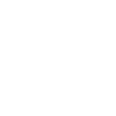

<p align="center">
  
</p>

<h1 align="center">Nitea for Minecraft mods</h1>

<p align="center">
  Free, privacy-first error tracking and player feedback for Minecraft mods.<br>
  <a href="https://nitea.cc">Website</a> · <a href="https://nitea.cc/d">Dashboard</a> · <a href="https://nitea.cc/legal/privacy-policy">Privacy policy</a>
</p>

---

Nitea is a small library you embed in your mod. It reports errors, uncaught exceptions and crashes caused by your mod to your [Nitea dashboard](https://nitea.cc/d), groups them into issues, and lets players send bug reports and suggestions that you can show on a public roadmap.

- **Opt-in only.** Nothing is sent until the player says yes. Nitea asks once, for every mod using it.
- **One Nitea per game.** However many mods embed it, they share one engine, one consent screen and one settings file.
- **Only your bugs.** Each mod only receives the errors and crashes its own code caused, never another mod's.
- **Anonymous.** No usernames, player UUIDs or IP addresses. Ever.
- **Zero dependencies.** The core is plain Java 17. Events are sent from a background thread and rate limited.

## Repository layout

| Folder | What it is |
| ------ | ---------- |
| [`nitea-java/`](nitea-java) | The core library: plain Java 17, no dependencies, works on any loader. Capturing, grouping, attribution, consent and sending. |
| [`nitea-neoforge/`](nitea-neoforge) | Nitea as a NeoForge mod (mod ID `nitea`): the consent screen and the title screen button. Embeds the core. |
| [`example-mod/`](example-mod) | A NeoForge 26.2 test mod that embeds Nitea and triggers errors, crashes and player reports on demand. |

## Player consent

Consent belongs to **Nitea, not to the mod that embeds it**. A player who installs five mods using Nitea is asked once, and their answer applies to all five.

1. The first time the title screen opens, Nitea shows its consent screen instead. It lists every mod using Nitea and explains what a report contains. The player has to choose **Allow reports** or **Don't allow**.
2. The answer is saved in `config/nitea/nitea.properties` and never asked again.
3. A Nitea button next to the title screen's small icon buttons opens the preferences screen, where the player can opt in or out at any time.

| State | What happens |
| ----- | ------------ |
| Not chosen yet | Events wait in memory (up to 25 per mod). Nothing leaves the computer. |
| Allowed | Waiting and new events are sent. A random installation ID is created to count affected players. |
| Not allowed | Waiting events are dropped, nothing is ever sent, the installation ID is deleted and the player isn't asked again. |

Crash reports written before the player allowed reporting are never sent.

On a dedicated server there is no screen: nothing is sent until the server owner sets `consent=granted` in `config/nitea/nitea.properties`.

```properties
# config/nitea/nitea.properties
consent=granted        # or denied
examplemod.enabled=false   # optional: turn off a single mod
```

## Many mods, one engine

Mods don't talk to each other, so Nitea makes sure they don't need to:

- **One copy.** Every NeoForge mod bundles `nitea-neoforge` with Jar-in-Jar. NeoForge loads a single copy, the newest, so there's one `nitea` mod, one consent screen and one title screen button.
- **Shared state.** Even when a mod shades its own copy of the core, every copy shares the same state: the consent, the installation ID and the list of mods using Nitea live in one JVM-wide registry made only of JDK types, readable whatever class loader loaded the copy. Changing the consent from any copy updates all of them at once.
- **Attribution.** Each mod registers its packages (and, on NeoForge, its Java module). When an uncaught exception or a Minecraft crash happens, Nitea starts from the root cause and walks the stack past JDK, Minecraft and loader frames. The first frame left decides:
  - it belongs to a mod using Nitea: only that mod reports it;
  - it belongs to another mod or library: nobody reports it;
  - it's Mixin code injected into the game (`handler$…$modid$…`): the mod that injected it.

  So when mod A calls mod B and B throws, B gets the issue, not A. When the game throws because A passed it bad data, A gets it.

Exceptions you pass to `captureException` yourself are always reported by your mod: you chose to send them.

## Using Nitea in your mod (NeoForge)

### 1. Add the dependency

Until Nitea is on a public Maven repository, publish it locally once:

```sh
cd nitea-java && ./gradlew publishToMavenLocal
cd ../nitea-neoforge && ./gradlew publishToMavenLocal
```

Then in your mod's `build.gradle` (ModDevGradle):

```groovy
repositories {
    mavenLocal()
}

dependencies {
    // Brings the core library with it, and bundles both in your jar
    jarJar(implementation("cc.nitea:nitea-neoforge")) {
        version {
            strictly '[0.2.0,1.0.0)'
            prefer '0.2.0'
        }
    }
}
```

### 2. Add your SDK key

Create a project on [nitea.cc](https://nitea.cc), copy its SDK key (`nt_…`) and put it in `src/main/resources/nitea/<modid>.properties`:

```properties
sdkKey=nt_your_sdk_key
```

Keep it out of git. The example mod generates this file at build time from a git-ignored `.env` (see [`example-mod/build.gradle`](example-mod/build.gradle)). The key can only send events to your project, never read anything.

You can also set it with the system property `-Dnitea.<modid>.sdkKey=…` or the environment variable `NITEA_<MODID>_SDK_KEY`.

### 3. Start Nitea

At the very start of your mod's constructor:

```java
@Mod(MyMod.MODID)
public final class MyMod {
    public static final String MODID = "mymod";
    public static NiteaClient NITEA;

    public MyMod(IEventBus modEventBus, ModContainer modContainer) {
        NITEA = Nitea.init(NiteaOptions.builder(MODID)
                .owner(MyMod.class)                                  // your package is "your code"
                .release(modContainer.getModInfo().getVersion().toString())
                .gameDir(FMLPaths.GAMEDIR.get())
                .build());
        // ...
    }
}
```

That's all. You never show a consent screen yourself: Nitea does it for you.

### 4. Report things

```java
NITEA.addBreadcrumb("machine", "Generator started");   // context attached to the next event
NITEA.setTag("difficulty", "hard");

try {
    loadConfig();
} catch (IOException e) {
    NITEA.captureException(e);                          // or captureException(e, Level.WARNING, Map.of(...))
}

NITEA.captureMessage("Network has no controller", Level.WARNING);

// Player feedback, e.g. from a command or a button
NITEA.reportBug(textFromPlayer);
NITEA.reportSuggestion(textFromPlayer, link -> player.sendSystemMessage(Component.literal(link)));
```

Reported automatically once `Nitea.init` has run:

- uncaught exceptions your mod caused
- Minecraft crash reports your mod caused, sent on the next launch

When your project has a public page, `reportBug` and `reportSuggestion` get back a one-time link where the player adds a description, steps and screenshots. On the client Nitea opens it in the browser; on a server, pass a callback and send the player the link.

### Other loaders

The core (`cc.nitea:nitea-java`) runs on Fabric, Quilt and Forge too, but the consent screen only exists for NeoForge so far. Without it the player can't be asked in game, so nothing is sent until `consent=granted` is set in `config/nitea/nitea.properties`.

## Options

| Option | Default | What it does |
| ------ | ------- | ------------ |
| `owner(Class)` | | A class of your mod. Its package marks your code, its class loader finds your resources. |
| `inAppPackages(String...)` | owner's package | Your code's packages, when it spans several. |
| `release(String)` | | Your mod version. |
| `gameDir(Path)` | working directory | Where `config/` and `crash-reports/` are. |
| `tag(String, String)` | | A tag sent with every event. |
| `maxBreadcrumbs(int)` | 100 | Breadcrumbs attached to each event (at most 100). |
| `captureUncaught(boolean)` | true | Report uncaught exceptions your mod caused. |
| `scanCrashReports(boolean)` | true | Report crash reports your mod caused, on the next launch. |
| `openReportLinks(boolean)` | true | Open the browser to complete player reports on the client. |
| `environment`, `minecraftVersion`, `loader`, `side` | detected | Override what Nitea detects. |
| `debug(boolean)` | false | Log every request and response. |

## Building

Requirements: JDK 25 (the core targets Java 17 bytecode).

```sh
cd nitea-java && ./gradlew build         # core library + tests
cd nitea-neoforge && ./gradlew build     # the NeoForge mod
cd nitea-neoforge && ./gradlew nsdk      # the files offered as "Download NSDK" on the website (build/nsdk)
```

### Try the example mod

1. On [nitea.cc](https://nitea.cc), create a project with mod ID `niteaexample` and copy its SDK key.
2. Copy `example-mod/.env.example` to `example-mod/.env` and paste the key.
3. From `example-mod/`, run `./gradlew runClient`. The library and the NeoForge mod are built from the sibling folders.
4. Answer Nitea's consent screen, then in game use the Faulty Wand from the "Nitea Example" creative tab, or the `/em` command:

| Command | What it does |
| ------- | ------------ |
| `/em nitea` | Shows whether reporting is on |
| `/em bug <text>`, `/em suggest <text>` | Player reports |
| `/em test error` | A caught exception with a "Caused by" chain |
| `/em test warning` | A message event |
| `/em test uncaught` | An exception nobody catches, on a worker thread |
| `/em test gamecrash` | Crashes the game. The crash report is sent on the next launch. |

Add `-Dnitea.debug=true` to the run configuration to log every request. Delete `run/config/nitea/nitea.properties` to see the consent screen again.

## Privacy

A report contains what went wrong (exception, stack trace, message), what the mod recorded (breadcrumbs, tags), the game setup (Minecraft, loader, Java and OS versions, CPU architecture and cores, maximum memory, client or server) and, only while the player allows reporting, a random installation ID. Never usernames, player UUIDs, IP addresses or chat. See the [privacy policy](https://nitea.cc/legal/privacy-policy).
